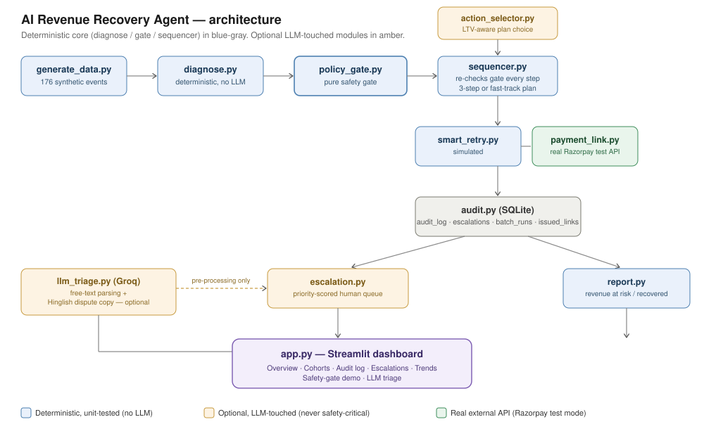

# AI Revenue Recovery Agent

**Razorpay Buildathon — Track: AI Revenue Recovery**


Processes a batch of failed Razorpay payment events, diagnoses why each one
failed, decides on a bounded recovery action, executes it through a
temporal multi-touch sequence, and reports measured revenue recovered —
all behind an auditable safety gate that stops it from doing anything
reckless (contacting an opted-out customer, touching a disputed payment,
or over-discounting). Cases the gate stops, or that never recover, land in
a priority-scored escalation queue instead of a dead end.



## Setup

```bash
git clone <this-repo>
cd revenue-recovery-agent
python3 -m venv .venv && source .venv/bin/activate
pip install -r requirements.txt

cp .env.example .env
# Fill in RAZORPAY_KEY_ID / RAZORPAY_KEY_SECRET with your Razorpay
# TEST-mode keys (https://dashboard.razorpay.com/app/keys).
# GROQ_API_KEY is optional — the app runs fully without it.

# Generate a fresh synthetic batch (176 events incl. 7 edge cases)
python -m src.generate_data

# Run the test suite
pytest tests/ -v

# (Optional) verify your Razorpay TEST-mode keys actually work
python -m scripts.check_razorpay_connection

# Launch the dashboard
streamlit run app.py
# If `streamlit` isn't on your PATH (common on Windows), use:
#   python -m streamlit run app.py
```

### Or with Docker

```bash
docker compose up --build
# then open http://localhost:8501
```

The `Dockerfile`/`docker-compose.yml` have now actually been run (not just
written and compiled locally) — a real run against the named volume surfaced
a genuine SQLite/Docker-volume interaction bug, now fixed; see "What broke"
below. Rebuild (`docker compose up --build`) to pick up the fix if you built
the image before.

See [`DEMO_SCRIPT.md`](DEMO_SCRIPT.md) for a 60-second walkthrough script
covering the dispute-halt safety demo, which is the strongest part of
the project to lead with, and [`docs/pitch/pitch_deck.pptx`](docs/pitch/pitch_deck.pptx)
for an 8-slide deck (problem → solution → safety gate → LTV-aware
routing → escalation → what's real vs. simulated → close) if you need
slides rather than a live dashboard walkthrough.

If `RAZORPAY_KEY_ID` / `RAZORPAY_KEY_SECRET` are not set, the app still
runs end to end — `pipeline.py` automatically falls back to a clearly
labeled *simulated* payment link (`simulated: true` in the audit trail)
so the full flow is demoable without live credentials.

## Architecture

See the diagram above. In short:

```
generate_data → diagnose → policy_gate → sequencer (+ action_selector) → adapters
                                                     ↓
                                                  audit.py (SQLite)
                                              ↙                    ↘
                                       escalation.py             report.py
                                              ↘                    ↙
                                              app.py (Streamlit dashboard)
```

- **`diagnose.py`** — a static `failure_reason_code -> bucket` lookup
  table (FINANCIAL / BEHAVIORAL / TECHNICAL). An unrecognized code is
  classified `UNKNOWN`, never guessed. Every event is validated first;
  a malformed row is marked `INVALID` with the specific reason, and the
  batch keeps going — nothing here ever raises on a single bad row.
- **`policy_gate.py`** — the single safety-critical decision point.
  `check_gate(event, diagnosis, proposed_action)` is a pure function:
  no network, no randomness, no LLM. Hard halts (`OPT_OUT`,
  `DISPUTE_RAISED`) are checked before soft constraints
  (`TOUCH_CAP_EXCEEDED`, `DISCOUNT_CAP_EXCEEDED`), so a disputed,
  over-touched, over-discounted case still blocks for the *dispute*
  reason. Missing `prior_touch_count` raises `GateInputError` instead
  of silently defaulting. `touch_cap`/`discount_cap_pct` are parameters,
  not globals, so a "what-if" caller can compare policies without
  mutating shared state.
- **`action_selector.py`** — decides the *menu* of actions offered for a
  case, based on customer LTV tier and diagnosed bucket. High-LTV
  customers on non-behavioral failures skip the impersonal `smart_retry`
  step and fast-track straight to a payment link. This never bypasses
  `policy_gate.py` — every action it proposes still gets gated exactly
  like any other.
- **`sequencer.py`** — runs the recovery sequence (standard 3-step, or a
  2-step fast-track) on an accelerated clock. `check_gate` is
  re-evaluated fresh before *every* step, so a dispute raised between
  steps halts the remaining sequence immediately and records which rule
  fired. Touch count *accumulates within the sequence* — a case that
  already had 2 prior touches can hit `TOUCH_CAP_EXCEEDED` mid-sequence,
  not just on some future separate run.
- **`escalation.py`** — every case the gate BLOCKED, or that ran its full
  sequence UNRECOVERED, gets a ticket: a route (`DISPUTE_RESOLUTION`,
  `RETENTION`, or `NONE` if it's not actually actionable — e.g.
  `OPT_OUT` still gets logged for compliance but routes to `NONE`, since
  escalating an opt-out to "contact them" would defeat the opt-out), a
  note explaining why, and a priority (`HIGH`/`MEDIUM`/`LOW`/`NONE`)
  from reason + amount + LTV tier. This is a triage aid only — it never
  changes what the gate allowed or blocked. Tickets have a real
  lifecycle (`OPEN` → `IN_PROGRESS` → `RESOLVED`, editable from the
  dashboard's Escalations tab) and **persist across re-runs of the same
  batch** — `pipeline.run_batch` only opens a fresh ticket for a
  payment_id if there isn't already an `OPEN`/`IN_PROGRESS` one, so a
  still-unresolved case doesn't spawn a duplicate every time you re-run
  the batch. If a case that was previously `RESOLVED` escalates again
  later, that *is* treated as a new issue and gets a new ticket.
  Clicking "Regenerate synthetic batch" mints an entirely new set of
  random `payment_id`s with no relationship to the old batch's, so
  persistence across *that* wouldn't mean anything — old tickets could
  never be matched, resolved, or deduped against again, just accumulate
  forever. The dashboard calls `audit.clear_escalations()` on regenerate
  for exactly that reason; see its docstring for the full case. Tickets
  can also be **claimed** — `ROUTE_TEAM_ROSTER` maps each actionable
  route to a small fixed set of names (purely a dashboard convenience;
  it has no bearing on routing or priority logic), and the Escalations
  tab lets you assign/unassign a ticket alongside its status, so the
  queue shows not just what's outstanding but who owns it. An
  "unassigned open work" count on the dashboard makes backlog with no
  owner visible at a glance.
- **`llm_triage.py`** — the *only* module that calls an LLM (Groq,
  `llama-3.3-70b`). Never imported by `diagnose.py`, `policy_gate.py`,
  `action_selector.py`, or `sequencer.py`. `parse_freetext_reason()` can
  only ever return a code already in `diagnose.REASON_CODE_MAP`, or
  `None` — it cannot invent a new bucket. Every call degrades gracefully
  (no key, a network error, or a hallucinated response all fall back to
  a safe default) rather than raising.
- **`adapters/payment_link.py`** — **real**: calls
  `razorpay.Client(...).payment_link.create()` in TEST mode and returns
  the real `plink_xxx` id. Wrapped by `pipeline.py` for **idempotency** —
  a payment_id that already has a link outstanding (tracked in the
  persistent `issued_links` table, which survives across runs) is never
  sent a second one. Any API error is caught and logged, never raised
  into the batch.
- **`adapters/smart_retry.py`** — **simulated**: there's no real
  "retry a failed payment" endpoint to call in test mode, so this
  models an outcome with a per-bucket success probability.
- **`adapters/confirmation.py`** — **simulated**: there's no real
  "did the customer actually pay" webhook to call either, for a
  payment link nobody in a demo is going to click. Separates the
  TECHNICAL success of creating a payment link from the BUSINESS
  outcome of the customer actually paying on it, via a probability
  model keyed on failure bucket (a behavioral/technical failure is
  modeled as more likely to resolve once nudged than a financial one,
  where the underlying cause often persists) and LTV tier. Only a
  case where `confirmed=True` counts as `RECOVERED` — see
  `sequencer.py`'s `send_payment_link` runner, which calls this
  *after* a successful link creation, never before or instead of it.
- **`audit.py`** — SQLite log, four tables: `audit_log` (one row per
  case/step), `escalations`, `issued_links` (idempotency), and
  `batch_runs` — a history of every pipeline run, deliberately **not**
  cleared when the rest of the DB resets, so the dashboard's Trends tab
  has something to plot.
- **`report.py`** — revenue at risk (everything that failed, regardless
  of outcome), gross/net recovered, net recovery rate, cohort
  breakdowns by both failure bucket and customer LTV tier, and the
  issued-vs-confirmed funnel (`links_issued_count`,
  `link_issued_not_confirmed_count`, `link_confirmation_rate_pct`) —
  the last of these is what keeps the top-line recovery number honest
  rather than conflating "we created a link" with "we got paid."
- **`report_pdf.py`** — renders the same report as a short, printable
  PDF (fpdf2, no system dependencies).
- **`pipeline.simulate_batch()`** — re-runs the same batch under
  different `touch_cap`/`discount_cap_pct`/cost assumptions, powering
  the dashboard's **What-if simulator** tab. It reuses the exact same
  `check_gate`/`sequencer`/`report` code as a real run — same rules,
  different parameters — but **never** touches the audit log, run
  history, or issued-links table, and never calls the real Razorpay
  API, even if live keys are configured. It's exploratory, not a real
  batch run; loosening the caps here never changes what `OPT_OUT` or
  `DISPUTE_RAISED` do, since those are hard halts independent of any
  cap.
- **`pipeline.run_multiday_simulation()`** + **`escalation.simulate_daily_triage()`**
  — power the dashboard's **Simulate a week** tab. Every simulated day
  goes through the exact same `run_batch()` path as a real run —
  nothing about the recovery logic is relaxed or faked. The only thing
  added on top is a seeded, priority-weighted simulation of a human
  team resolving part of the escalation queue between days (higher
  `priority_score` tickets resolve more often, same reasoning as the
  score itself), so the Trends and Escalations tabs get a queue that
  realistically grows *and* shrinks across a week instead of one flat
  batch or an ever-accumulating pile. This is the only place in the
  codebase that simulates ticket resolution — `run_batch()`'s normal
  path never does, since resolving a real ticket is something an
  actual human does.

### What's real vs. simulated

| Component | Real | Simulated |
|---|---|---|
| Payment link creation | ✅ Razorpay TEST-mode API (`plink_xxx` ids), idempotent | Falls back to a labeled simulated link if no keys are set |
| Smart retry outcome | — | ✅ probability model per failure bucket |
| Payment *completion* confirmation | — | ✅ probability model per failure bucket + LTV tier (`adapters/confirmation.py`) — only a confirmed case counts as `RECOVERED`. `links_issued_count` (technical: link created) is reported separately from confirmed recovery, since those are genuinely different things and collapsing them was misleading — see the funnel section on the dashboard's Overview tab. |
| Time delays (T+24h, T+72h) | — | ✅ accelerated/simulated clock, no real waiting |
| Diagnosis, policy gate, action selection, sequencing | ✅ fully real, deterministic code | — |
| Audit log, escalation queue, run history | ✅ real SQLite database | — |

### Why no AI in the diagnosis/gate/sequencer/action-selection path

The rules that decide *whether money moves and who gets contacted* —
bucket classification, opt-out/dispute/touch-cap/discount-cap
enforcement, step progression, and which action plan a case gets — are
all deterministic and unit-tested. An LLM is probabilistic and can
hallucinate; putting one in the safety-critical path would mean a policy
that occasionally decides to text a customer who opted out, because the
model "felt" that seemed fine. Instead, the LLM (Groq, `llama-3.3-70b`)
is scoped to two clearly non-critical, optional jobs:

1. Parsing ambiguous, free-text failure descriptions into a
   best-guess reason code *before* they reach the deterministic
   mapper (which still independently validates the result).
2. Generating templated Hinglish customer-facing copy for the
   dispute-halt notification — wording, not decision-making.

If the LLM is unavailable or `GROQ_API_KEY` isn't set, both of these
degrade gracefully; nothing in the safety-critical path depends on it.

## What broke during development (and how it was fixed)

While wiring up `diagnose.py` against the synthetic batch, the
duplicate-`payment_id` edge case initially slipped through as two
separate `VALID` diagnoses instead of flagging the second occurrence.
The root cause: the first version of `diagnose_batch` checked each
event against a `seen_payment_ids` set that was populated *before*
validation ran, so a genuinely duplicate id that also happened to be
well-formed got added to the "seen" set twice, on the same pass,
before either row was compared against it.

The fix made the ordering explicit: `diagnose_event` only *checks*
membership in `seen_payment_ids`, and the caller only adds an id
*after* the check for that row has already run — and, in a later
hardening pass, an id is now tracked as "seen" the moment it's
encountered at all (valid or not), so a duplicate is caught even when
the *first* row with that id was itself invalid for an unrelated
reason. This is covered by `test_duplicate_caught_even_when_first_occurrence_was_invalid`
in `tests/test_diagnose.py`.

A second one, later in the build: while inserting `pipeline.simulate_batch()`
above the existing `pipeline.run_batch()`, an edit accidentally deleted
`run_batch`'s own `def` line, silently turning its entire body into
dead code appended after `simulate_batch`'s `return`. Every existing
unit test still passed — none of them imported `run_batch` by name,
since `policy_gate.py`/`diagnose.py`/`sequencer.py` tests all exercise
the pieces in isolation. It only surfaced when `run_batch` was called
directly outside the test suite. The fix was the missing line itself,
but the more durable fix was `tests/test_pipeline_run_batch.py` — an
integration test that imports and calls `run_batch` end to end,
including one test (`test_run_batch_is_importable_and_callable_twice_in_a_row`)
written specifically so this exact class of bug — a wiring break that
no individual module's unit tests would catch — fails loudly next time.
A related, quieter bug surfaced at the same time: `audit.py`'s DB-path
parameters defaulted to `db_path: Path = DB_PATH`, which binds that
default at *import* time — so a test monkeypatching `audit.DB_PATH` to
an isolated file had no effect on any caller (like `run_batch`) that
didn't pass a path explicitly. Fixed by resolving `db_path or DB_PATH`
inside each function body instead of in the signature, so the module
global is read fresh on every call.

A third one surfaced after moving to Docker for the first time: a real
run against a Docker Desktop named volume on Windows crashed partway
through with `sqlite3.OperationalError: disk I/O error` inside
`log_step`. The cause was `log_step`/`log_escalation`/
`record_issued_link`/`log_batch_run` each calling `conn.commit()`
individually — for a ~170-case batch with up to 3 steps per case, that
meant several hundred separate fsync-backed commits in one run, which
some Docker volume backends can't sustain under that write frequency.
The fix: those functions no longer commit at all — `pipeline.run_batch`
now opens one connection, logs everything for the whole batch, and
commits exactly once before closing. That also made each run's audit
trail atomic (a crash mid-batch now leaves nothing partially written,
rather than a half-committed trail), and `get_connection` sets
`PRAGMA synchronous = NORMAL` as a second line of defense against the
same class of issue. Since closing a SQLite connection with an
uncommitted transaction silently discards it (not an error, just data
loss), `tests/test_audit.py` had to change too — every test now calls
`conn.commit()` explicitly where it previously relied on each logging
function committing for it — plus a new
`test_log_step_and_log_escalation_require_caller_to_commit` pinning the
new contract so a future edit can't quietly reintroduce a commit
inside those functions without a test noticing.

A fourth: adding `adapters/confirmation.py` and wiring it into
`sequencer.py`'s `send_payment_link` runner immediately broke
`test_recovery_at_step2_stops_before_step3` and
`test_fast_track_plan_skips_smart_retry_entirely` — both had been
passing an unseeded confirmation roll (falling through to the module-
level `random`, since no `confirmation_fn` was injected), so they were
flaky by construction the moment "link created" stopped being
equivalent to "recovered." The fix was the same pattern already used
for `smart_retry_fn`/`payment_link_fn`: both tests now inject an
explicit deterministic `confirmation_fn` (`_always_confirms`), and two
new tests (`test_link_issued_but_not_confirmed_is_not_recovered`,
`test_confirmation_fn_never_called_when_link_creation_itself_fails`)
pin the actual new behavior — a link can exist without ever being paid,
and confirmation is never even attempted if link creation itself failed.

A fifth: adding ticket lifecycle status meant `escalations` needed to
stop being wiped by `reset_db()` on every run — a ticket a human is
meant to work through has to survive past the next time someone clicks
"Run pipeline on current batch," unlike `audit_log`, which really is
just a snapshot of the current batch's step-by-step trail. That created
a new problem `reset_db()` used to solve for free: a case still
unresolved from a prior run would otherwise get a brand-new duplicate
ticket every single re-run, piling up the queue with copies of the same
underlying issue. The fix was `get_open_escalation()` — check for an
existing `OPEN`/`IN_PROGRESS` ticket for a payment_id before writing a
new one, and only open a fresh ticket if none exists (or the only prior
one was already `RESOLVED`, which is a legitimate new issue, not a
duplicate). `test_run_batch_does_not_duplicate_open_escalation_tickets_across_runs`
and `test_run_batch_opens_new_ticket_after_prior_one_was_resolved` pin
both halves of that behavior. Existing databases created before this
change pick up the new `status`/`updated_at` columns automatically via
a best-effort `ALTER TABLE` in `get_connection()` — no manual migration
or DB wipe needed.

A sixth surfaced almost immediately after the fifth, from actually
clicking through the dashboard rather than just running tests: making
`escalations` persist solved the duplicate-ticket problem for re-runs
of the *same* batch, but "Regenerate synthetic batch" mints an entirely
new set of random `payment_id`s every time — so persistence meant the
queue just grew by a full batch's worth of now-orphaned tickets on
every regenerate, with no way to ever resolve or dedupe against them
again (158 open tickets after a handful of clicks in testing). The fix
is `clear_escalations()`, called specifically from the regenerate
button handler in `app.py` (not from `reset_db()`, which fires on every
pipeline run and would defeat the whole point of persistence) — since
a new batch's payment_ids share nothing with the old batch's, keeping
their tickets around served no purpose except growing the queue
forever. `test_clear_escalations_leaves_batch_runs_and_issued_links_untouched`
pins that this is scoped to escalations only — run history and link
idempotency correctly don't care that the batch changed.

A seventh, caught while building the multi-day simulator: the first
version of the "Simulate a week" button popped `st.session_state["pipeline_result"]`
after running the simulation, intending to force the Overview/Cohorts
tabs to refresh. Instead it silently triggered the dashboard's own
first-load bootstrap logic ("if `pipeline_result` isn't set, run the
pipeline once against whatever's in `data/synthetic_events.json`") —
an entirely unrelated extra `run_batch()` call that added a stray row
to run history and displayed data with nothing to do with the week
just simulated. This wasn't caught by any unit test, since it's a
UI-wiring bug, not a logic bug — it only surfaced when the dashboard
was actually clicked through with Streamlit's `AppTest` framework
(`at.button[...].click(); at.run()`) rather than just checked for
clean startup logs. The fix: `run_multiday_simulation()` now carries
the full `run_batch()` result for the last simulated day
(`last_day_full_result`) in its return value, and the button handler
sets `pipeline_result` to that directly instead of popping it and
hoping something else recomputes it correctly.
`test_records_one_batch_run_per_day` and
`test_last_day_full_result_matches_run_batch_shape` pin the fix at the
function level; the `AppTest`-based click-through (clicking twice in a
row, checking `batch_runs` grew by exactly the right amount both
times) is what actually caught it and isn't part of the pytest suite,
since it needs a running Streamlit script context — worth remembering
as a gap in what automated tests alone would have caught here.

## Limitations & next steps

Being upfront about what this is and isn't:

- **Recovery numbers are still optimistic, just less so.** "Recovered"
  now requires a simulated payment *confirmation*, not merely a
  created link (see `adapters/confirmation.py`) — on the current
  synthetic batch this drops the headline recovery rate from the
  ~90-98% link-issuance number earlier versions reported down to a
  more credible ~50-55%. But the confirmation probabilities themselves
  (0.30-0.70 depending on bucket/tier) are still a hand-tuned
  assumption, not measured from real payment behavior — treat the
  *shape* of the funnel (issued vs. confirmed, and that confirmation
  varies by failure cause) as the useful signal, not the exact
  percentage.
- **Synthetic data, generated and evaluated by the same codebase.**
  Good for proving the pipeline works end to end; not evidence it would
  perform this way on real traffic.
- **Escalation tickets now have status, ownership, and a fixed roster
  (`OPEN`/`IN_PROGRESS`/`RESOLVED` + assignee), but no SLA tracking or
  auth.** Anyone can claim or reassign any ticket — there's no login,
  no "this is actually me," and no concept of "overdue," which a real
  ops queue would eventually want. The roster itself
  (`ROUTE_TEAM_ROSTER` in `escalation.py`) is a small hardcoded list of
  placeholder names, not pulled from any real directory/HR system.
- **Docker has now been run for real** (not just written) — see "What broke"
  above for the SQLite fsync-storm bug that surfaced and its fix.
- **"Simulate a week" resolves tickets with a simulated human team, not
  a real one.** `escalation.simulate_daily_triage()` is explicitly and
  only used by this demo mode — the resolution probabilities
  (`DAILY_RESOLUTION_PROBABILITY`) are exactly as hand-tuned as the
  confirmation rates above, tuned to produce a readable demo (queue
  that visibly grows and shrinks) rather than fit to any real team's
  actual throughput. It never runs as part of a genuine `run_batch()`
  call — resolving a real ticket stays something an actual person does.
- **What-if simulator results aren't persisted or exportable.** They're
  deliberately kept out of the audit trail (see `pipeline.simulate_batch`
  above) so exploration never contaminates real history, but that also
  means there's currently no way to save a scenario for later comparison
  beyond eyeballing the on-screen baseline-vs-scenario table.

## Tests

```bash
pytest tests/ -v
```

151 tests across twelve files (`test_diagnose.py`, `test_policy_gate.py`,
`test_sequencer.py`, `test_llm_triage.py`, `test_action_selector.py`,
`test_escalation.py`, `test_audit.py`, `test_report.py`,
`test_pipeline_run_batch.py`, `test_pipeline_simulate.py`,
`test_confirmation.py`, `test_pipeline_multiday.py`, plus the pipeline
smoke test in CI), covering:

- Boundary conditions (touch cap at exactly 3, discount cap at exactly 5)
- Hard-halt priority over soft constraints, even when both would fire
- `GateInputError` on missing/malformed input, including malformed
  `event`/`diagnosis`/`proposed_action` types and a non-numeric
  `discount_pct`
- Truthy-but-non-boolean `opt_out`/`dispute_raised` values still block
  (the gate errs toward blocking on ambiguous input, never toward
  allowing)
- The dispute-halt mid-sequence scenario, touch-cap accumulation across
  steps, and the fast-track plan skipping `smart_retry` entirely
- A payment link successfully **created** is not automatically
  **confirmed** — `link_issued=True` with `recovered=False` is a real,
  tested state, and `confirmation_fn` is never even called if link
  creation itself failed
- Duplicate `payment_id` detection even when the *first* occurrence of
  that id was itself invalid for an unrelated reason
- `NaN`/`Infinity` amounts rejected rather than silently passing a
  `<= 0` check
- `llm_triage.py` degrading safely with no API key, a simulated network
  failure, and a hallucinated/out-of-vocabulary response — via a mocked
  Groq client, so the suite needs no real key or network access
- Escalation routing/priority (`HIGH`/`MEDIUM`/`LOW`/`NONE`) staying
  correct across every reason / amount / LTV-tier combination
- Escalation ticket lifecycle: `escalations` survives `reset_db()` same
  as `issued_links`; a still-unresolved case never gets a duplicate
  `OPEN` ticket across repeated runs, but a `RESOLVED` one that
  escalates again correctly gets a fresh ticket; invalid status values
  are rejected; a pre-existing database missing the `status`/
  `updated_at`/`assigned_to` columns (tested against both the very
  first schema and the intermediate one that had `status` but not
  `assigned_to` yet) picks them up via the `ALTER TABLE` migration
  without needing a manual reset
- Escalation ticket assignment: starts unassigned, claiming/unclaiming
  round-trips correctly (including an empty string normalizing to
  unassigned rather than becoming a literal `""` owner), and every
  actionable route (`DISPUTE_RESOLUTION`/`RETENTION`) has a non-empty
  roster so the dashboard's dropdown can never offer an empty list for
  a ticket someone is supposed to be able to claim
- `clear_escalations()` empties the queue regardless of status but
  leaves `batch_runs`/`issued_links` untouched — proven directly, not
  just asserted, since those two persisting is the whole point of the
  regenerate-batch fix (see "What broke" above)
- Idempotent payment links surviving a full `reset_db()` (audit_log
  clears every run; `issued_links` deliberately does not)
- `batch_runs` history surviving `reset_db()` for the Trends tab
- `run_batch` importable and callable end to end, twice in a row
  (integration-level regression guard — see "What broke" above)
- `run_multiday_simulation` records exactly one `batch_runs` row per
  simulated day (no stray extras — the exact bug the seventh "what
  broke" entry describes), clears any pre-existing escalation queue
  before starting, produces a realistic mix of resolved/still-open
  tickets by the end (not all-resolved, not zero-resolved), and
  higher-priority tickets resolve more often across a simulated week —
  plus `simulate_daily_triage` itself is deterministic under a seeded
  RNG and never returns an id that wasn't in its input
- `simulate_batch` never writes to the audit database, and produces
  results that actually respond to tighter/looser caps and different
  cost assumptions (not just accepting the parameters silently)
- `adapters/confirmation.py`'s probability model: technical/behavioral
  buckets confirm at a higher rate than financial, HIGH LTV tier beats
  LOW, results are deterministic under a seeded RNG, and the computed
  probability never escapes `[0, 1]` regardless of which bucket/tier
  combination produces the highest or lowest base rate

CI (`.github/workflows/tests.yml`) runs the full suite plus a pipeline
smoke test on Python 3.11 and 3.12 on every push/PR.

## Project structure

```
revenue-recovery-agent/
├── README.md
├── DEMO_SCRIPT.md            (60-second judge walkthrough)
├── docs/architecture.svg
├── Dockerfile
├── docker-compose.yml
├── .dockerignore
├── .github/workflows/tests.yml
├── .env.example
├── .gitignore
├── requirements.txt
├── data/
│   ├── synthetic_events.json
│   └── audit.db              (created on first pipeline run)
├── src/
│   ├── generate_data.py
│   ├── diagnose.py
│   ├── policy_gate.py
│   ├── action_selector.py    (LTV-aware action plans)
│   ├── sequencer.py
│   ├── escalation.py         (priority-scored human handoff)
│   ├── llm_triage.py         (optional, non-safety-critical LLM use)
│   ├── pipeline.py           (orchestrates the full batch run)
│   ├── adapters/
│   │   ├── payment_link.py
│   │   ├── smart_retry.py
│   │   └── confirmation.py   (link-issued vs. payment-confirmed split)
│   ├── audit.py
│   ├── report.py
│   └── report_pdf.py
├── docs/
│   ├── architecture.svg
│   └── pitch/pitch_deck.pptx (8-slide judge deck)
├── scripts/
│   └── check_razorpay_connection.py
├── app.py                    (Streamlit — Overview / Cohorts / Audit
│                               log / Escalations / Trends / Simulate
│                               a week / What-if simulator / Safety-gate
│                               demo / LLM triage tabs)
└── tests/
    ├── test_policy_gate.py
    ├── test_diagnose.py
    ├── test_sequencer.py
    ├── test_llm_triage.py
    ├── test_action_selector.py
    ├── test_escalation.py
    ├── test_audit.py
    ├── test_report.py
    ├── test_pipeline_run_batch.py
    ├── test_pipeline_simulate.py
    ├── test_confirmation.py
    └── test_pipeline_multiday.py
```
